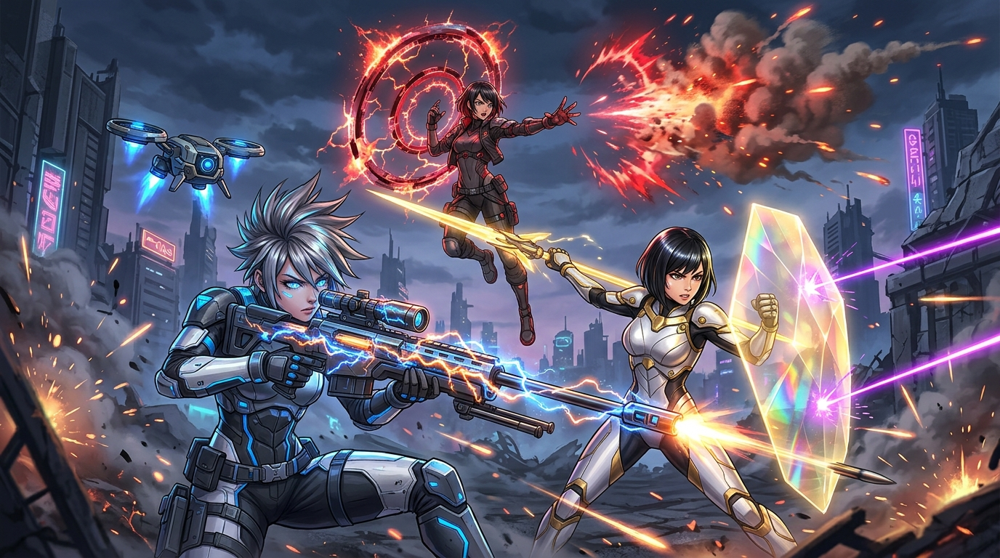

# WAIFU DESTINY: Combat Kits & Skill Trees v1.0
*Design Pillars: Controlled Chaos • High-Mobility Evasion • Runaway Synergy*

---

### Concept Art: Operative Abilities in Action

*Left: Nova firing charged S7 Rail Sniper with Seraph Drone • Center: Ria deploying Crimson Halo Ring • Right: Lux executing Prismatic Shield & Lance combo.*

---

## 🎮 Universal Combat Mechanics

Every Operative in *WAIFU DESTINY* possesses core mechanical systems that bridge fast-paced anime action with Destiny's tactile gunplay:

```
┌─────────────────────────────────────────────────────────────┐
│                 UNIVERSAL COMBAT MECHANICS                  │
├───────────────────┬───────────────────┬─────────────────────┤
│   AERO JET-DASH   │   PERFECT DODGE   │   OVERDRIVE SUPER   │
│ Omnidirectional   │ NieR: Automata    │ Destiny "Super"     │
│ Stamina / 2-Stock │ Witch Time + Perk │ Relic Charge / F Key│
└───────────────────┴───────────────────┴─────────────────────┘
```

1. **Aero Jet-Dash (Shift / Space):** Rapid directional thruster burst with brief invulnerability frames (i-frames). Can be chained into a slide or aerial float.
2. **Perfect Dodge Counter (NieR influence):** Evading an attack within a 0.2s window activates **Chronostasis** (0.75s local slow-motion) and instantly recharges the Tactical Skill.
3. **Overdrive Super (Ultimate):** Charged via defeating swarms, collecting relic energy orbs, and precision kills. Clears entire arenas or turns the tide against World Bosses.

---

## 🎯 1. Codename: NOVA — *The Silent Star*
*Archetype: Star Ranger • Combat Role: Long-Range Precision, Perimeter Overwatch, Drone Command*

```
                             [ NOVA: TALENT MATRIX ]
                                       │
        ┌──────────────────────────────┼──────────────────────────────┐
        │                              │                              │
┌───────▼───────┐              ┌───────▼───────┐              ┌───────▼───────┐
│ DEADEYE TREE  │              │ GHOST INFILTR │              │ SERAPH SWARM  │
│ Infinite Pierce│             │ Camo Stalker  │              │ Twin Drones   │
│ Crit Shrapnel │              │ Weakpoint Ex. │              │ Missile Pods  │
└───────────────┘              └───────────────┘              └───────────────┘
```

### Signature Arsenal & Core Kit
- **Primary Weapon:** `S7 Anti-Material Rail Sniper`
  - *Fire Mode:* Semi-Auto / High-Velocity Kinetic.
  - *Charge Mechanic:* Holding ADS charges the shot up to 3 tiers, increasing armor penetration and bullet diameter.
  - *Precision Multiplier:* 3.25x Weakpoint Damage.
- **Passive — Ocular Calibrator:**
  - Consecutive precision hits grant stacking **Target Lock** (up to 5 stacks). Each stack grants +10% Reload Speed and +12% Critical Damage. At max stacks, shots pierce through terrain and armor shields.
- **Tactical Skill (10s CD) — Vector Mirage Dash:**
  - Nova jet-boosts backward or laterally, cloaking herself in optical camouflage for 3 seconds while deploying a holographic decoy that draws enemy aggression.
- **Companion Module — Seraph Scout Drone:**
  - Autonomous drone hovering over Nova’s shoulder. Automatically fires pulse lasers at flanking enemies and continuously paints elite weakpoints through fog and geometry.
- **Overdrive Super — Apex Nova: Orbital Ion Beam:**
  - Nova anchors her suit to the ground and overcharges the S7 with Aurelian relic plasma. Fires a gargantuan blue ion beam across the battlefield that vaporizes all swarms in its trajectory and leaves an electro-charged scorched trail.

### Key Talent Nodes
- **Deadeye T3 — Shatter-Point:** Kills on elite weakpoints cause the enemy core to detonate in a 12m kinetic explosion, staggering surrounding swarms.
- **Ghost T2 — Phantom Velocity:** Exiting stealth grants +50% movement speed and guarantees the next sniper shot is an automatic critical hit.
- **Seraph T3 — Twin Valkyries:** Deploys a second combat drone equipped with micro-missile pods that automatically fire at airborne targets.

---

## 🛡️ 2. Codename: LUX — *Platinum Halo Guardian*
*Archetype: Vanguard • Combat Role: Frontline Paladin, Hardlight Bastion, Crowd Stagger*

```
                              [ LUX: TALENT MATRIX ]
                                       │
        ┌──────────────────────────────┼──────────────────────────────┐
        │                              │                              │
┌───────▼───────┐              ┌───────▼───────┐              ┌───────▼───────┐
│ BULWARK TREE  │              │ VALKYRIE TREE │              │ DAWN BEACON   │
│ Retaliation   │              │ Lance Charges │              │ Squad Shields │
│ Shield Reflect│              │ Kinetic Smash │              │ Consecration  │
└───────────────┘              └───────────────┘              └───────────────┘
```

### Signature Arsenal & Core Kit
- **Primary Weapon:** `Halo Lance & Hardlight Aegis`
  - *Combos:* 3-hit forward thrust string ending in an expanding radial shockwave.
  - *Secondary Guard:* Holding Right-Click raises the Aegis Shield, blocking 85% of incoming frontal damage.
- **Passive — Radiant Bastion:**
  - Blocking damage or hitting with the lance charges Lux's **Halo Meter**. When full, her next shield bash releases a 15m blinding light wave that disarms enemies for 3 seconds.
- **Tactical Skill (12s CD) — Divine Aegis:**
  - Projects a massive, curved golden hardlight wall in front of Lux. The wall blocks all incoming enemy projectiles while allowing squad members to shoot through it with a +25% damage boost. Converts 20% of absorbed damage into party overshields.
- **Offensive Skill (8s CD) — Astral Javelin:**
  - Lux throws a radiant kinetic spear into the ground, pinning light enemies and consecrating a 10m golden aura that burns alien constructs while accelerating squad stamina regeneration.
- **Overdrive Super — Halo Resonance: Divine Judgment:**
  - Lux hovers into the air, spreading translucent hardlight angel wings. Releases an apocalyptic shockwave of blinding light that permanently staggers heavy elites, purges all squad debuffs, and grants 10 seconds of unbreakable overshields.

### Key Talent Nodes
- **Bulwark T3 — Aegis Reflection:** Projectiles blocked by Divine Aegis are reflected back at attackers as homing radiant darts.
- **Valkyrie T2 — Skyfall Breaker:** Jumping while casting Astral Javelin turns it into an aerial plunge attack that shatters enemy shields in a 360° radius.
- **Dawn T3 — Sanctuary Matrix:** Allies standing in Lux's consecrated zone gain health siphon on hit.

---

## ⚡ 3. Codename: RIA — *Crimson Halo Infiltrator*
*Archetype: Void Weaver / Relic Seeker • Combat Role: Area Denial, High-Velocity Breach, Chain Detonations*

```
                              [ RIA: TALENT MATRIX ]
                                       │
        ┌──────────────────────────────┼──────────────────────────────┐
        │                              │                              │
┌───────▼───────┐              ┌───────▼───────┐              ┌───────▼───────┐
│ SINGULARITY   │              │ THERMAL PYRE  │              │ BLADEMASTER   │
│ Vortex Pull   │              │ Napalm Bursts │              │ Dash Resets   │
│ Gravity Rift  │              │ Chain Detonate│              │ Blade Combos  │
└───────────────┘              └───────────────┘              └───────────────┘
```

### Signature Arsenal & Core Kit
- **Primary Weapon:** `Glassfang Arm-Blades & Dual Obsidian SMGs`
  - *Playstyle:* Seamless transitions between hyper-velocity close-range arm-blade slashes and high-cadence dual-SMG suppression.
- **Passive — Thermal Supercharge:**
  - Every enemy eliminated inside Ria’s proximity builds her **Heat Gauge**. Grants up to +40% Attack Speed and +30% Sprint Speed. At 100% Heat, her melee strikes ignite targets with lingering void-fire.
- **Tactical Skill (7s CD) — Glassfang Breach:**
  - Ria phases forward in a blur of crimson light, slicing through all enemies in a 12m line. Targets struck are afflicted with **Shatter-Marks**; killing marked enemies instantly resets the cooldown of Glassfang Breach.
- **Halo Apparatus — Infernal Halo Emitter:**
  - Ria detaches the floating mechanical halo from behind her head and flings it like a spinning sawblade, or anchors it to the ground as a pulsating thermal hazard zone that melts enemy armor.
- **Overdrive Super — Charm Protocol: Singularity Nova:**
  - Ria’s halo expands into a colossal rotating crimson ring above the arena. Emits an irresistible gravitational pulse that drags up to 50 enemies into the epicenter, then implodes with a deafening void detonation.

### Key Talent Nodes
- **Singularity T3 — Gravitational Collapse:** Enemies pulled by Charm Protocol have their armor reduced to 0 for 6 seconds.
- **Thermal T2 — Chain Reaction:** Any enemy killed by Infernal Halo explodes, triggering a chain reaction across all nearby burning targets.
- **Blademaster T3 — Phantom Execution:** Glassfang Breach deals +200% damage to targets below 30% health.

---

## 💥 Cross-Class Synergy Combos (Squad Chemistry)

When combining operatives in co-op expeditions or quick-swap squad play:

| Operative 1 | Operative 2 | Synergy Name | Combined Effect |
|---|---|---|---|
| **Ria (Singularity)** | **Nova (Apex Ion Beam)** | **Event Horizon Execution** | Ria’s Super pulls 50+ enemies into a single dense sphere; Nova fires her piercing ion beam directly through the singularity, wiping the entire horde in one shot. |
| **Lux (Divine Aegis)** | **Nova (S7 Rail Sniper)** | **Prismatic Railgun** | Nova fires through Lux’s hardlight wall, splitting her single high-damage sniper bullet into 3 refracted piercing lasers. |
| **Lux (Astral Javelin)** | **Ria (Infernal Halo)** | **Solar-Void Annihilation** | Consecrated light zone + Thermal burn zone create an elemental collision that periodically triggers self-sustaining micro-supernovas. |
