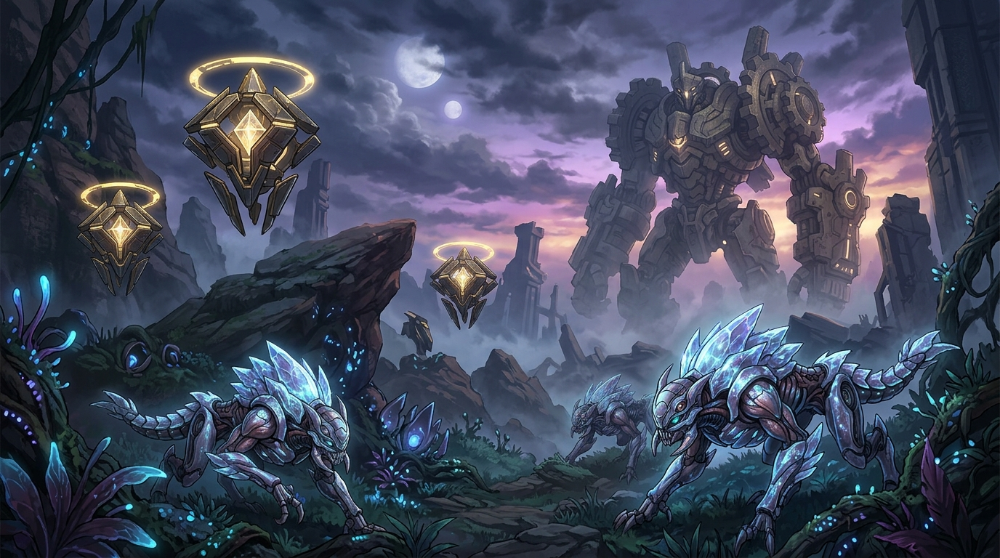
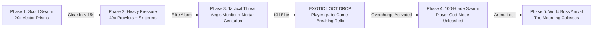

# WAIFU DESTINY: Bestiary & Enemy Factions v1.0
*Combat Mandate: "Controlled Chaos" — From 20 fodder to a 100-swarm horde with towering colossi.*

---

### Concept Art: The Constructs of Aurelia

*Foreground: Silicon-chitin prowler beasts. Midground: Floating geometric Halo Sentinels. Background: The Colossus Titan of the Machine Wastelands.*

---

## 🏛️ 1. The Lumina Sentinels (The Living Geometry)
*Biome: Sky Islands & Levitating Temples*  
*Aesthetic Fusion: Halo Forerunner × Destiny Vex × Genshin Ruin Machines*

```
               ┌───────────────────────────────────────┐
               │         THE LUMINA SENTINELS          │
               │   White Stone • Gold Trim • Hardlight │
               └───────────────────┬───────────────────┘
         ┌─────────────────────────┼─────────────────────────┐
         │                         │                         │
┌────────▼────────┐       ┌────────▼────────┐       ┌────────▼────────┐
│  VECTOR PRISM   │       │  AEGIS MONITOR  │       │ APEX DOME-CORE  │
│ Swarm Needler   │       │ Tether Shielder │       │ Beam Artillery  │
│ Swarms of 20-40 │       │ Grants Immunity │       │ Mini-Boss       │
└─────────────────┘       └─────────────────┘       └─────────────────┘
```

The ancient architects left automated custodians to guard the atmospheric terraforming arrays and relic vaults. They do not fight with malice; they execute algorithmic defense protocols with surgical precision.

### Unit Roster
1. **Vector Prism (Fodder / Swarm):**
   - Floating pyramidal drones that hover in geometric formations.
   - Attack: Rapid-fire hardlight needles. When destroyed, they shatter into kinetic shrapnel.
   - Pacing: Spawns in clusters of 15–30 to pressure the player's perimeter.
2. **Aegis Monitor (Support Elite):**
   - Octahedron unit crowned with a golden hardlight halo ring.
   - Behavior: Locks an invulnerability tether onto surrounding heavy units. Players must prioritize them or use Nova’s piercing rifle to crack their inner core.
3. **Apex Dome-Core (Zone Boss):**
   - A gigantic levitating temple keystone with interlocking rings.
   - Attacks: Rotates its outer shell to sweep 360° sweeping laser grids across the arena, demanding precision jet-dash timing.

---

## 🐺 2. The Bio-Ferrum Swarm (Crystal Chitin Prowlers)
*Biome: Crystal Forests & Subterranean Groves*  
*Aesthetic Fusion: Avatar Pandoran Fauna × Risk of Rain Beetle / Lemurian swarms*

Silicon-based predatory fauna that evolved by synthesizing discarded nanites and bioluminescent mineral deposits into their biology.

### Unit Roster
1. **Spore Skitterers (Light Melee):**
   - Quadrupedal insectoid beasts with glowing azure back-crystals.
   - Attack: High-speed leap attacks. When slain, release a luminescent dust cloud that slows movement speed unless cleansed.
2. **Crystal Razor-Prowler (Medium Ambush):**
   - Feline biomechanical predators that camouflage within the forest's blue foliage.
   - Attack: Sudden wall-pounces and ranged crystalline spine bursts launched from their tails.
3. **Bramble Goliath (Super-Heavy Elite):**
   - Massive armored quadruped walking tank. Its crystalline carapace deflects standard kinetic fire, requiring players to target exposed cooling vents underneath its flank.

---

## ⚙️ 3. The Rust Remnants (Ancient Battle Automata)
*Biome: Machine Wastelands & Desolate Canyons*  
*Aesthetic Fusion: NieR: Automata Goliath class × Destiny Fallen Heavy Frames*

Dormant military colossi from a forgotten civilization’s planet-wide war. Reawakened by the player’s arrival, their damaged neural cores broadcast broken military directives and melancholy radio static.

### Unit Roster
1. **Scrap Drudge (Swarm Infantry):**
   - Bipedal mechanical skeletons wielding industrial welding lances and buzz-saws.
   - Attack: Erratic, twitching charges; self-detonate if their power core is ruptured.
2. **Mortar Centurion (Artillery Elite):**
   - Four-legged tracked chassis equipped with dual micro-missile silos.
   - Role: Forces the player out of cover by carpeting the arena with explosive red telegraph circles.
3. **The Mourning Colossus (World Boss):**
   - A 50-meter-tall walking war machine with rotating gears, chest-mounted laser batteries, and massive fist slams that generate expanding shockwaves.

---

## 🌌 4. The Abyssal Voidforms (Entropy Constructs)
*Biome: Abyssal Depths & Core Reactor Chambers*  
*Aesthetic Fusion: Subnautica Leviathans × Destiny Taken / Void Energy*

Entities born from leaking zero-point reactors buried deep within Aurelia's crust. They manipulate local gravity and corrupt living technology.

### Unit Roster
1. **Void Leech (Disruption Swarm):**
   - Flying shadow-eels that latch onto the player's suit, draining jet-dash stamina and skill cooldowns until shaken off with a melee blast.
2. **Singularity Weaver (Elite Caster):**
   - Creates gravitational vortexes (mini black holes) that pull the player and explosive canisters into their center.
   - Counterplay: Ria’s *Infernal Burst* or Lux’s *Divine Aegis* can shatter the vortex before it collapses.

---

## ⚡ 5. Encounter Progression & Horde Architecture

To satisfy the **"Controlled Chaos"** combat pillar, encounters strictly follow the escalation sequence:



### Risk of Rain 2-Inspired Elite Affix System
When an Elite spawns, it rolls one of four dynamic elemental mutations:

| Elite Affix | Visual Cue | Gameplay Effect |
|---|---|---|
| **Glacial** | Pale cyan frost aura | Leaves freezing floor trails; explodes into a massive ice nova on death. |
| **Volatile** | Pulsing magma veins | Spawns homing thermal orbs that track the player while shooting. |
| **Overloading** | Crackling purple arc sparks | Passive lightning shield; attacks inflict electro-magnetic delay on player shields. |
| **Singularity** | Swirling obsidian void ring | Periodically emits a gravitational shockwave that pulls in all combatants. |
