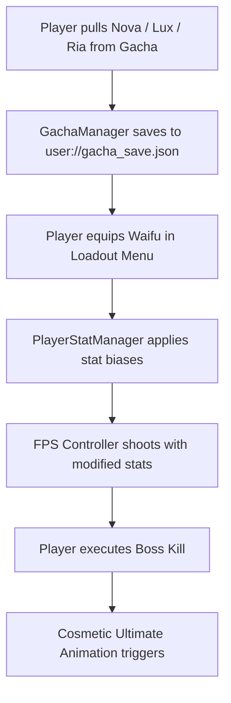

# WAIFU DESTINY: Gacha & Cel-Shaded Architecture Pipeline v1.0
*Merging Gacha Waifu Aesthetics with a Destiny-Lite Browser FPS Loop in Godot 4.x*

---

## 🌸 1. Strategic Decision: Light Gameplay Integration (Path B)

We locked in **Path B: Light Gameplay (Balanced)**:
- **No Pay-To-Win Multipliers:** Gunplay skill, precision aiming, and movement remain supreme.
- **Each Waifu provides:**
  1. **1 Passive Bias Perk** (e.g., Nova: +15% weakpoint crit / +10% reload; Lux: +20% shields; Ria: +8% speed).
  2. **1 Cosmetic Ultimate Animation** (Screen flourish, hardlight wings, or rotating halo glyphs on boss kills or ability triggers).
  3. **Distinct 3D Cel-Shaded Model & First-Person Sleeves / Gloves.**

---

## 🎨 2. Cel-Shaded Rendering Pipeline (Godot 4.x GL Compatibility)

All shaders are written and optimized for browser/HTML5 performance:

```
┌────────────────────────────────────────────────────────┐
│               CEL-SHADED RENDERING STACK               │
├──────────────────────────┬─────────────────────────────┤
│ 1. Toon Cel Ramp         │ 2. Inverted Hull Outline    │
│ [toon_cel_shader.gdshader]│ [outline_shader.gdshader]   │
│ - 3-step lighting cutoff │ - Normal extrusion in vertex│
│ - Cool shadow tinting    │ - Front-face culling        │
│ - Specular highlight band│ - Resolution-scaled width   │
│ - Fresnel rim lighting   │ - Screen-space uniform lines│
└──────────────────────────┴─────────────────────────────┘
```

- **Toon Shader Path:** [`res://characters/shaders/toon_cel_shader.gdshader`](file:///c:/Users/young/OneDrive/Documents/Desktop/GAME%20D3V/d3/characters/shaders/toon_cel_shader.gdshader)
- **Outline Shader Path:** [`res://characters/shaders/outline_shader.gdshader`](file:///c:/Users/young/OneDrive/Documents/Desktop/GAME%20D3V/d3/characters/shaders/outline_shader.gdshader)

---

## 🎴 3. Gacha System Engine (`gacha_manager.gd`)

Implemented in [`res://gacha/gacha_manager.gd`](file:///c:/Users/young/OneDrive/Documents/Desktop/GAME%20D3V/d3/gacha/gacha_manager.gd):

### Pity & Probability Rules
- **Base 5★ Rate:** `0.6%`
- **Base 4★ Rate:** `5.1%`
- **Soft Pity (Pull 74–89):** Linearly escalates by `+6%` per pull up to guaranteed at 90.
- **Hard Pity 5★:** Guaranteed at pull `90`.
- **4★ Guarantee:** Guaranteed at least one 4★ or weapon every `10` pulls.
- **50/50 Event Banner:** 50% chance for featured character on first 5★; if lost, next 5★ is 100% guaranteed featured.
- **Offline Storage:** Automatically writes state to `user://gacha_save.json` (persists in browser `IndexedDB` / `LocalStorage`).

---

## 🧍♀️ 4. Character Registry (`character_registry.json`)

Stored in [`res://characters/waifus/character_registry.json`](file:///c:/Users/young/OneDrive/Documents/Desktop/GAME%20D3V/d3/characters/waifus/character_registry.json):

```json
{
  "id": "waifu_001_nova",
  "name": "Nova",
  "title": "Silent Star",
  "rarity": 5,
  "element": "Cryo/Kinetic",
  "role": "Marksman / Sniper Specialist",
  "perk": {
    "name": "Ocular Target Lock",
    "description": "+15% Weakpoint Crit Damage, +10% Reload Speed on precision hits",
    "stat_modifiers": {
      "crit_damage": 0.15,
      "reload_speed": 0.10
    }
  },
  "ultimate": {
    "name": "Apex Orbital Ion Beam",
    "cosmetic_fx": "Piercing blue plasma beam, lingering electric scorch trail, anime screen slash flourish"
  }
}
```

---

## 🧩 5. Shooter Loop Integration (`player_stat_manager.gd`)

Implemented in [`res://combat/player_stat_manager.gd`](file:///c:/Users/young/OneDrive/Documents/Desktop/GAME%20D3V/d3/combat/player_stat_manager.gd):



---

## 📁 6. Godot Project Architecture

```
/ (Workspace Root)
├── project.godot                  # Godot 4.3 Web GL Compatibility config
├── characters/
│   ├── waifus/                    # character_registry.json
│   ├── skins/                     # Mesh variants
│   └── shaders/
│       ├── toon_cel_shader.gdshader
│       └── outline_shader.gdshader
├── gacha/
│   ├── gacha_manager.gd           # 90-pity, 50/50, LocalStorage engine
│   ├── banners/                   # Banner metadata
│   ├── pools/                     # Drop tables
│   ├── ui/                        # Gacha screen UI scenes
│   └── animations/                # Starburst & silhouette animations
├── combat/
│   ├── player_stat_manager.gd     # Bridges Waifu perks to FPS stats
│   ├── weapons/                   # S7 Sniper, Halo Lance, SMGs
│   └── abilities/                 # Jet dash, drone, shields
├── ui/
│   ├── hud/                       # Destiny-minimalist HUD with anime portrait
│   ├── inventory/                 # Roster & cosmetic switcher
│   └── gacha/                     # 10-pull carousel UI
├── loot/                          # Golden beam & artifact drops
├── world/                         # Aurelia biomes
└── assets/                        # Key art, character datasheets & textures
```
