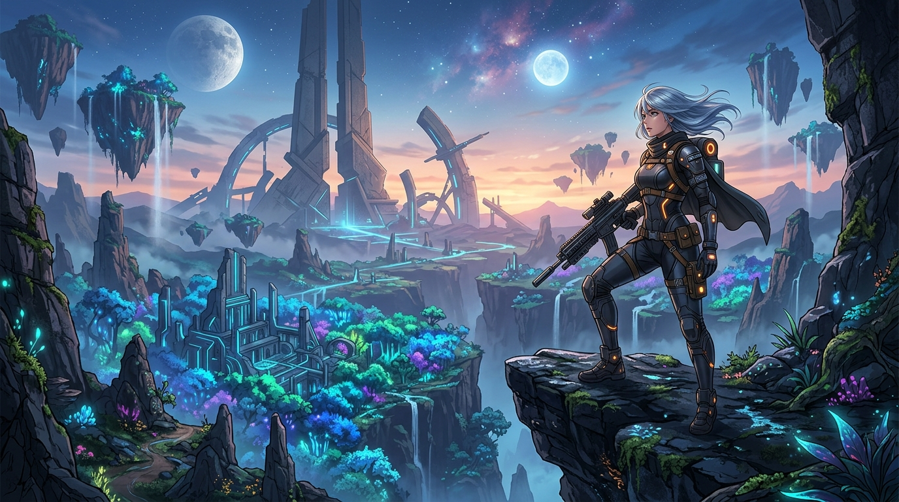
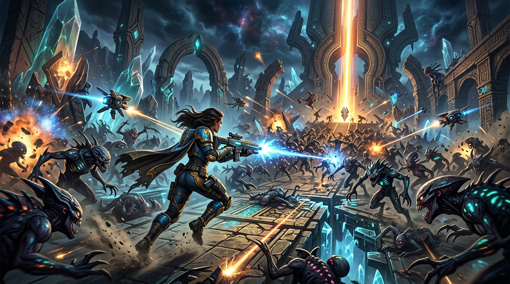

# WAIFU DESTINY
## Moodboard Bible v1.0

> **The North Star:**  
> *"I am an elite explorer uncovering the secrets of a beautiful alien world while becoming absurdly powerful through discovery and loot."*

---

### Concept Key Art

| **Key Art #1: The Vista of Aurelia** | **Key Art #2: Controlled Chaos & Exotic Drops** |
|:---:|:---:|
|  |  |
| *"I want to see what's over that hill."* | *"Controlled Chaos meets Exotic Loot."* |

---

## 1. Core Emotional Pillars

The player should feel:
- **Wonder**
- **Discovery**
- **Adventure**
- **Power Growth**
- **Mystery**
- **Optimism**

### What We Are NOT:
- ❌ Hopeless
- ❌ Dark Horror
- ❌ Gritty Military Shooter
- ❌ Dreary Post-Apocalypse
- ❌ Generic Sci-Fi

### Core Mindset
> **YES:** *"I want to see what's over that hill."*  
> **NO:** *"Everything is dead and depressing."*

---

## 2. Visual DNA

```
┌────────────────────────────────────────────────────────┐
│ 40% Destiny                                            │
│ Ancient alien ruins, lost tech, massive scale          │
├──────────────────────────────────────┬─────────────────┤
│ 30% Genshin / Wuthering Waves        │ 20% Nier        │
│ Beautiful characters, vibrant world  │ Melancholy elegance
├──────────────────────────────────────┴─────────────────┤
│ 10% Risk of Rain 2                                     │
│ Build experimentation, run progression, horde pressure │
└────────────────────────────────────────────────────────┘
```

- **40% Destiny:** Ancient alien ruins, lost technology, massive architectural scale, mysterious geometric structures.
- **30% Genshin Impact / Wuthering Waves:** Beautiful characters, vibrant & colorful open landscapes, bright exploration, stylized realism.
- **20% NieR: Automata:** Melancholy beauty, forgotten civilizations, fluid and elegant combat choreography.
- **10% Risk of Rain 2:** Addictive build experimentation, runaway power scaling, escalating horde encounters.

---

## 3. World Design — Planet: AURELIA

**Keywords:** Alien Eden • Lost Civilization • Living Technology • Ancient Megastructures • Floating Geometry • Bioluminescence

### Biomes & Environment References

| Biome | Visual Motifs & Atmosphere | Reference Fusion |
|---|---|---|
| **Crystal Forests** | Towering glowing flora, soft blues, purple luminescent canopies, hidden ruins | *Avatar* + *Destiny Dreaming City* + *Wuthering Waves* |
| **Sky Islands** | Levitating geometric landmasses, ancient temples, cloud seas, vertical exploration | *Journey* + *Genshin Impact* + *Halo Forerunner* |
| **Machine Wastelands** | Colossal dormant automatons, mechanical skeletal remains, ancient battlefields | *NieR: Automata* + *Destiny* |
| **Abyssal Depths** | Subterranean monolithic cities, pulsating alien reactors, high-threat endgame zones | *Subnautica* + *Destiny Raid Spaces* |

---

## 4. Character Design Philosophy

> **Explorer First. Waifu Second.**

### Aesthetic Rules
- **Embrace:** Professional relic hunters, functional futuristic expedition gear, clean silhouettes, tactile high-tech accessories.
- **Avoid:** Oversexualized tropes, generic high-school uniforms, fantasy ballgowns/princess dresses, hyper-skimpy outfits devoid of context.

### Class Archetypes & Character Roster
*(See complete operational profiles in [CHARACTERS.md](file:///c:/Users/young/OneDrive/Documents/Desktop/GAME%20D3V/d3/CHARACTERS.md), detailed skill trees in [COMBAT_KITS.md](file:///c:/Users/young/OneDrive/Documents/Desktop/GAME%20D3V/d3/COMBAT_KITS.md), and gacha/cel-shaded engine architecture in [GACHA_PIPELINE.md](file:///c:/Users/young/OneDrive/Documents/Desktop/GAME%20D3V/d3/GACHA_PIPELINE.md))*

```
                     ┌──────────────────┐
                     │   CLASS ROSTER   │
                     └────────┬─────────┘
        ┌─────────────────────┼─────────────────────┐
        │                     │                     │
┌───────▼───────┐     ┌───────▼───────┐     ┌───────▼───────┐     ┌───────────────┐
│  STAR RANGER  │     │  VOID WEAVER  │     │ RELIC SEEKER  │     │   VANGUARD    │
│ Precision/Dash│     │ Alien Energy  │     │ Turret/Loot   │     │ Shield/Heavy  │
│ e.g. NOVA     │     │ e.g. RIA      │     │ e.g. NYX      │     │ e.g. LUX      │
│ White•Gold•Teal│    │ Purple•Silver │     │ Tech Scavenger│     │ 2B meets Titan│
└───────────────┘     └───────────────┘     └───────────────┘     └───────────────┘
```

1. **Star Ranger**
   - *Role:* Precision Rifle Specialist, Jet-Dash mobility, tactical Drone Companion.
   - *Palette:* High-sheen White, Sovereign Gold, Bioluminescent Teal.
2. **Void Weaver**
   - *Role:* Gravitational anomaly manipulation, micro black holes, blink teleportation.
   - *Palette:* Deep Void Purple, Obsidian Black, Quicksilver.
3. **Relic Seeker**
   - *Role:* Ancient artifact weaponizer, deployable autonomous turrets, loot detection & cache cracking.
   - *Palette/Theme:* Sci-fi expeditionary leather & tech weave (*Indiana Jones* × Sci-Fi Anime).
4. **Vanguard**
   - *Role:* Frontline heavy ordnance, kinetic energy shields, close-range breach-and-clear.
   - *Palette/Theme:* Heavy ballistic plating with haute couture elegance (*Destiny Titan* × *2B* aesthetics).

---

## 5. Combat & Encounter Pacing
*(See full bestiary, enemy factions, and elite affix systems in [ENEMIES.md](file:///c:/Users/young/OneDrive/Documents/Desktop/GAME%20D3V/d3/ENEMIES.md))*

> **NOT:** Military cover shooter (Call of Duty / Gears)  
> **YES:** Controlled Chaos & Escalating Godhood

### Encounter Escalation Loop
$$\text{20 Enemies} \longrightarrow \text{40 Enemies} \longrightarrow \text{Elite Mini-Boss} \longrightarrow \text{Artifact Upgrade} \longrightarrow \text{100-Horde Swarm} \longrightarrow \text{Megastructure Boss}$$

- Player feedback sensation: *Constantly on the razor edge of being overwhelmed, yet executing with god-tier power.*

---

## 6. Loot & Progression

**Drop Sensation:** *Destiny Exotic* drop celebration meets *Diablo Legendary* endorphin spike.

### Rare Drop Experience
- Colossal pillar beam of golden/prismatic light piercing skyward.
- Resonant, tactile auditory cue with low-frequency punch.
- Dynamic camera micro-framing / chromatic aberration flourish.
- Instant player emotional reaction: **"WAIT, WHAT IS THAT?!"**

---

## 7. Dungeon Design Pillars

Every subterranean ruin, vault, and derelict structure must feature:
- **Mystery:** Locked kinetic seals, cryptic electromagnetic signals, dormant alien consoles.
- **Discovery:** Branching subterranean vistas, destructible walls, hidden elite bosses, relic chambers.
- **Scale:** Jaw-dropping interior volume, distant architectural landmarks, cyclopean machinery that makes the player feel both small and intrepid.

---

## 8. UI & UX Aesthetics

- **Style:** Destiny meets Apple Human Interface meets Sci-Fi Minimalism.
- **Visuals:** Translucent glassmorphism, subtle edge bloom, ultra-clean typography, fluid physics-based transitions.
- **Strictly Avoid:** MMO screen clutter, illegible micro-text, mobile-game notification badge overload.
